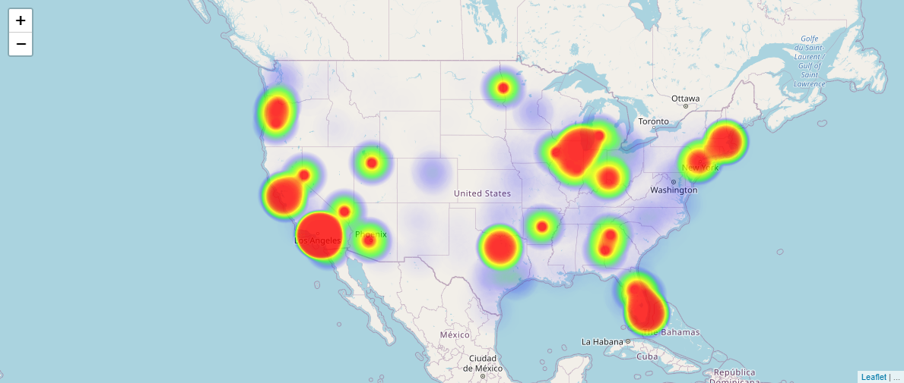

# Leaflet Heatmap Demo

Demo for creating a heatmap. Uses Leaflet and heatmap.js to produce a heatmap of the top 1000 US Cities by population. See a live demo [here](https://median-man.github.io/leaflet-heatmap-demo/).



## Resources

- [cities.json](https://gist.github.com/Miserlou/c5cd8364bf9b2420bb29) - Source for population data.
- [heatmap.js](https://www.patrick-wied.at/static/heatmapjs/) - Plugin for creating heat map layer for Leaflet.
- [Leaflet](https://leafletjs.com/) - Mapping Library
- [OpenStreetMap Tiles](https://wiki.openstreetmap.org/wiki/Tiles) - Map tile images for Leaflet map base layer.

## Usage

This app is built using Webpack 4. Several npm scripts have been configured to make building and development easy.

First install dependencies:

```sh
npm install
```

To create a production build:

```sh
npm run build
```

To run a live development server and open in browser:

```sh
npm start
```

To create a development build:

```sh
npm run build-dev
```
